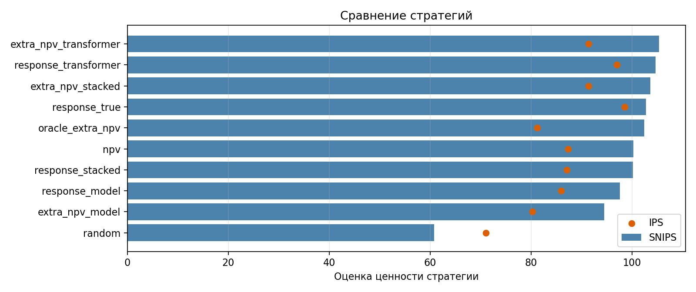
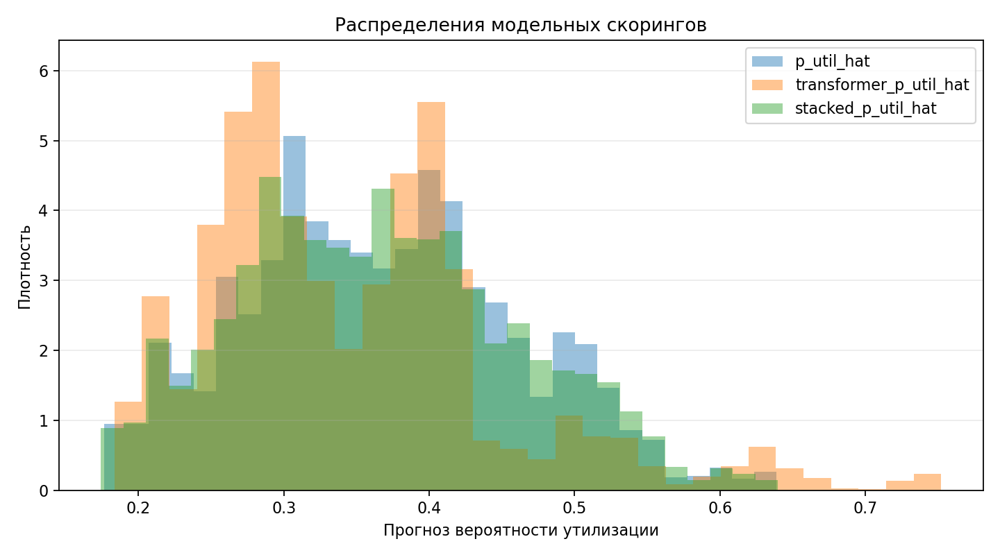

# Synthetic CrossSell ML Project

[](https://github.com/anday2004/jmlc-crosssell-ml-prio-synthetic/actions/workflows/ci.yml)

Публичная синтетическая реализация проекта по персонализированному
ранжированию CrossSell-предложений под ограничения NDA для JMLC в ИТМО.

Репозиторий воспроизводит инженерную и ML-логику задачи, а не рабочие данные
или производственный код.

## Результаты с первого взгляда (default demo, `seed=42`)

Оффлайн-оценка стратегий на будущем `test`-периоде. `random` заметно проигрывает
модельным стратегиям, последовательностная (transformer) ветка лучшая по
category-level SNIPS, а синтетический `oracle_extra_npv` задает верхнюю границу
по истинному добавочному эффекту.

| Стратегия | SNIPS | DR-style | True extra NPV |
|---|---:|---:|---:|
| `extra_npv_transformer` | **105.4** | 102.8 | 40.7 |
| `extra_npv_stacked` | 103.6 | 101.8 | 40.6 |
| `oracle_extra_npv` *(синтетический потолок)* | 102.4 | 99.3 | **45.2** |
| `random` *(нижняя граница)* | 60.8 | 63.6 | 25.8 |





Полная таблица по всем десяти стратегиям — в [`docs/final_demo_results.md`](docs/final_demo_results.md).
Графики детерминированы (`seed=42`) и пересобираются командой из раздела [Запуск](#запуск).

## Почему модели написаны с нуля

Бустинг, mini-transformer encoder, S-learner и stacking реализованы вручную на
`numpy`/`pandas`, без `scikit-learn`, `xgboost` или `torch`. Это осознанный
выбор для публичной версии: репозиторий тривиально воспроизводится и ревьюится,
ничего не спрятано за черным ящиком библиотеки, а зависимости минимальны и
NDA-безопасны (не тянут внутренний стек). Корректность ключевых метрик
(`roc_auc`, `average_precision`, `brier`) сверена со scikit-learn в
[`tests/test_metrics_numeric.py`](tests/test_metrics_numeric.py).

## Основная идея

Проект моделирует задачу персонального выбора нескольких CrossSell-категорий
для клиента. Для каждого пользователя сначала скорируются все пары
пользователь--категория, после чего из доступного преселекта собирается top-3
набор с ограничением: в одной выдаче не должно быть двух категорий из одного
`group_id`.

В открытой версии реализованы три модельных слоя:

- табличный бустинг на агрегированных признаках пользователя и категории;
- mini-transformer encoder по историческим событиям клиента;
- stacking-модель, которая использует прогнозы трансформера как дополнительные признаки.

Трансформерная часть важна отдельно от бустинга. Табличная модель видит уже
собранные агрегаты, а трансформер получает историю событий клиента:
клики, транзакции, действия в приложении и прошлые CrossSell-взаимодействия.
Эти события превращаются в последовательность токенов, проходят через
self-attention, а затем объединяются с embedding категории. Такой подход
позволяет учитывать порядок, давность и контекст событий, которые сложно
полностью описать ручными табличными признаками.

В задаче сравниваются два подхода к ранжированию:

- `response ranking`: приоритизация по `p(utilization) * NPV`;
- `extra NPV ranking`: приоритизация по `NPV * (p1 - p0)`.

Для оценки используются randomized logs. Они нужны, чтобы сравнивать новую
политику ранжирования с базовыми стратегиями без прямого запуска на всей
аудитории.

В репозитории нет рабочих данных, внутреннего кода, настоящих категорий,
метрик или конфигураций. Вместо этого реализован воспроизводимый
синтетический контур:

- генерация пользователей, историй событий, доступных категорий, рандомизированных показов и фактов утилизации;
- обучение табличного бустинга, S-learner для uplift, mini-transformer encoder по событиям и stacking-модели;
- скоринг всех пар пользователь--категория;
- выбор top-3 категорий с учетом доступности и запрета на повтор `group_id`;
- сравнение random, NPV-only, response ranking, extra NPV и синтетического оракула;
- оффлайн-оценка стратегий по randomized logs.

## Структура репозитория

```text
synthetic_crosssell_extra_npv_repo/
├── README.md
├── requirements.txt
├── requirements-airflow.txt
├── Dockerfile
├── run_experiment.py
├── .github/workflows/
│   └── ci.yml
├── dags/
│   └── crosssell_dag.py
├── article/
│   ├── crosssell_extra_npv_public.tex
│   └── crosssell_extra_npv_public.pdf
├── docs/
│   ├── event_history_contract.md
│   ├── final_demo_results.md
│   ├── methodology.md
│   ├── nda_boundary.md
│   └── img/
│       ├── policy_comparison.png
│       └── score_distributions.png
├── notebooks/
│   ├── demo.ipynb
│   └── README.md
├── skills/
│   ├── example_council_review.md
│   ├── ai-analyst-workflow/
│   ├── jmlc-adaption-council/
│   ├── ml-code-workflow/
│   ├── ml-data-workflow/
│   ├── ml-model-improvement/
│   └── uplift-policy-workflow/
├── utils/
│   ├── __init__.py
│   ├── data.py
│   ├── models.py
│   ├── metrics.py
│   ├── policies.py
│   ├── evaluation.py
│   └── plots.py
└── tests/
    ├── test_pipeline.py
    └── test_metrics_numeric.py
```

## Контракт данных

В синтетическом проекте используются четыре основные таблицы:

| Таблица | Гранулярность | Назначение |
|---|---|---|
| `users` | одна строка на пользователя | стабильные признаки пользователя и скрытые синтетические свойства |
| `categories` | одна строка на категорию | NPV, `group_id`, эмбеддинги, признаки доступности |
| `events` | одна строка на историческое событие | клики, транзакции, действия в приложении, прошлые CrossSell-события |
| `assignments` | одна строка на пользователя, период и категорию | рандомизированный показ, вероятность назначения, факт утилизации |

Самый важный проектный документ: [`docs/event_history_contract.md`](docs/event_history_contract.md). В нем описано, как должны генерироваться исторические события и как их преобразовывать в последовательности для трансформера без утечки таргета.

Дополнительно:

- [`docs/methodology.md`](docs/methodology.md): постановка, модели, стратегии и IPS/SNIPS-оценка;
- [`docs/nda_boundary.md`](docs/nda_boundary.md): что именно синтетическое и какие детали намеренно не раскрываются.

## Реализованный пайплайн

1. Сгенерировать синтетических пользователей, категории и исторические события.
2. Сформировать преселект доступных категорий для каждой пары пользователь--период.
3. Провести рандомизированный показ внутри тех же продуктовых ограничений, которые будут использоваться стратегиями.
4. Сгенерировать потенциальные исходы `p0`, `p1`, наблюдаемую утилизацию и синтетический эффект для оракула.
5. Обучить табличную модель отклика и S-learner для uplift: одна outcome-модель получает признаки пары пользователь--категория и флаг показа `shown_feature`.
6. Обучить mini-transformer encoder истории клиента: события превращаются в токены, проходят через self-attention и attention pooling, затем объединяются с embedding категории.
7. Обучить stacking-модель, которая использует табличные признаки и трансформерные прогнозы.
8. Проскорить все пары пользователь--категория и жадно собрать топ-3 категории с разными `group_id`.
9. Оценить стратегии через IPS/SNIPS и сравнение с синтетическим оракулом.

## Стратегии

В `utils/policies.py` разделены скоринг и выбор:

- `response_model`: приоритизация по `p(utilization) * NPV`;
- `extra_npv_model`: приоритизация по `NPV * (p1 - p0)`;
- `response_transformer` и `extra_npv_transformer`: те же стратегии, но на прогнозах трансформерной ветки;
- `response_stacked` и `extra_npv_stacked`: стратегии на stacking-модели;
- `random`, `npv`, `response_true`, `oracle_extra_npv`: базовые и оракульные стратегии для проверки качества на синтетике.

Стратегия выбирает категории жадно: берет лучшую доступную категорию, удаляет из преселекта все категории с тем же `group_id`, затем выбирает следующую до топ-3.

## Как читать результаты

В синтетике есть несколько типов качества:

- `IPS/SNIPS`: оценка новой стратегии по randomized logs;
- `DR`: диагностическая оценка в стиле doubly robust на отложенном периоде; она комбинирует randomized logs и прогноз ценности;
- `true_extra_npv_value`: синтетический oracle-сигнал, доступный только потому, что генератор знает истинные `p0` и `p1`.

Основная таблица качества считается на `test`-периоде. Из-за конечного размера randomized logs oracle не обязан быть первым по IPS/SNIPS в каждом маленьком запуске. Зато он должен быть сильным по `true_extra_npv_value`, а `random` должен заметно проигрывать модельным стратегиям. В дефолтном `notebooks/demo.ipynb` обычно получается именно такая картина: random внизу, модельные стратегии выше, oracle задает верхнюю синтетическую границу.

Для дефолтного demo (`seed=42`) типичный sanity check:

- `random`: SNIPS около `61`, true extra NPV около `26`;
- `extra_npv_transformer`: SNIPS около `105`, true extra NPV около `41`;
- `extra_npv_stacked`: SNIPS около `104`, true extra NPV около `41`;
- `oracle_extra_npv`: максимальный true extra NPV около `45`.

Финальная таблица результатов сохранена в [`docs/final_demo_results.md`](docs/final_demo_results.md).

## Мой вклад / Contribution

В публичной версии я реализовал весь воспроизводимый контур проекта: генератор синтетических данных, randomized logs, модели отклика и uplift, mini-transformer encoder по событиям, stacking, слой выбора с ограничениями, IPS/SNIPS/DR-оценку, метрики, тесты, воспроизводимую инженерную обвязку (CLI, Dockerfile, GitHub Actions, иллюстративный Airflow DAG) и NDA-safe документацию.

В реальной рабочей постановке мой вклад соответствует ML-части end-to-end: формализация таргета и единицы решения, подготовка исторических данных, обучение и сравнение моделей, скоринг всех пар клиент--категория, переход от response ranking к extra NPV логике, оффлайн-оценка стратегий и согласование ограничений раздачи с продуктовыми правилами.

## Навыки ИИ

В папке `skills/` лежат проектные навыки, которые формализуют помощь ИИ по этапам ML-работы:

- `ai-analyst-workflow`: анализ метрик, логов, дашбордов и подготовка задач/отчетов с подтверждением пользователя;
- `jmlc-adaption-council`: проверка конкурсной версии проекта с учетом ML, causal, product, MLOps и NDA;
- `ml-data-workflow`: данные, временные срезы, event history и утечки;
- `ml-code-workflow`: воспроизводимый код, demo, notebook и тесты;
- `ml-model-improvement`: улучшение бустинга, transformer, stacking и диагностик;
- `uplift-policy-workflow`: S-learner, extra NPV, randomized logs и проверка policy evaluation.

Два разобранных прогона навыка `jmlc-adaption-council` по этому репозиторию (вход → находки → внесенное исправление) лежат в [`skills/example_council_review.md`](skills/example_council_review.md).

## Что смотреть в коде

- `utils/data.py`: синтетика, randomized logs, потенциальные исходы и sequence table для трансформера;
- `utils/models.py`: табличный бустинг, обучаемый mini-transformer encoder, S-learner и stacking;
- `utils/policies.py`: greedy top-3 policy с ограничением на уникальный `group_id`;
- `utils/evaluation.py`: IPS/SNIPS, out-of-time DR-style diagnostic, ESS и bootstrap;
- `utils/metrics.py`: AUC/AP/Brier и uplift alignment;
- `notebooks/demo.ipynb`: основной интерактивный запуск для ревью;
- `run_experiment.py`: параметризуемый терминальный запуск того же пайплайна (`run_pipeline`);
- `dags/crosssell_dag.py`: иллюстративная Airflow-оркестрация поверх тех же step-функций;
- `Dockerfile`, `.github/workflows/ci.yml`: воспроизводимая сборка и CI (тесты на каждый push);
- `skills/`: навыки для системной работы с данными, кодом, моделями, uplift и NDA-safe адаптацией.

## Запуск

У проекта три входа поверх одного движка (`run_pipeline` в `run_experiment.py`):
интерактивный notebook, CLI и Airflow DAG. Логика нигде не дублируется.

```bash
pip install -r requirements.txt
```

**1. Notebook (основной способ ревью).**

```bash
jupyter lab notebooks/demo.ipynb
```

Выполнить `Run All`. Сохраняет таблицы в `artifacts/notebook_demo` и показывает
test-split результаты: проверки синтетики, топ стратегий по SNIPS, AUC/AP/Brier
для модельных голов и alignment predicted uplift с истинным эффектом.

**2. CLI (параметризуемый, для воспроизводимости).**

```bash
python run_experiment.py --users 80 --categories 12 --periods 6 --seed 42 --artifacts-dir artifacts/run_01
```

Чтобы пересобрать диагностические графики (в т.ч. картинки для README):

```bash
python run_experiment.py --users 80 --categories 12 --periods 6 --seed 42 --plots-dir docs/img
```

**3. Airflow DAG (иллюстрация оркестрации).** Шаги `generate → score → policies →
evaluate` вызывают те же функции из `utils/`. Это публичная параллель к
продакшн-оркестрации, которая под NDA живет в закрытом контуре (GitLab + Airflow).

```bash
pip install -r requirements-airflow.txt   # только для DAG
# затем зарегистрировать dags/crosssell_dag.py в своем Airflow
```

## Docker и CI

Образ собирается и реально запускает пайплайн с тестами:

```bash
docker build -t crosssell-extra-npv .
docker run --rm crosssell-extra-npv
```

CI на GitHub Actions ([`.github/workflows/ci.yml`](.github/workflows/ci.yml))
на каждый push прогоняет `pytest`, smoke-запуск пайплайна и сборку Docker-образа;
статус виден по бейджу в шапке README.

Основные файлы в `artifacts/notebook_demo` или `artifacts/run_01`:

- `README.md`: короткая сводка запуска и топ стратегий;
- `evaluation.csv` и `evaluation_test.csv`: IPS/SNIPS, DR, ESS, бутстреп-интервалы и синтетическое oracle-сравнение;
- `evaluation_all.csv`: такая же диагностика на всех split для sanity check;
- `model_quality.csv`: AUC, Average Precision и Brier для модельных голов;
- `uplift_alignment.csv`: корреляция predicted uplift с синтетическим истинным эффектом;
- `policy_assignments.csv`: какие категории выбрала каждая стратегия;
- `policy_slot_counts.csv`: проверка топ-3 и уникальности `group_id`;
- `model_score_summary.csv`: распределения прогнозов моделей;
- `transformer_sequence_sample.csv`: пример токенизированной истории без будущих событий.

Запуск тестов:

```bash
pytest
```
